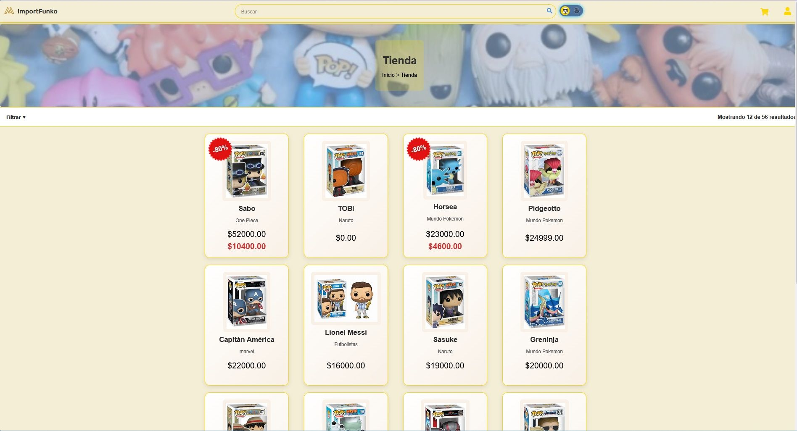

# API REST E-commerce con Django REST Framework

Proyecto backend orientado a la construccion de una API REST para un sistema de e-commerce, desarrollada con Django REST Framework y PostgreSQL. La aplicacion permite gestionar el flujo principal de una tienda online, incluyendo productos, categorias, carritos, favoritos, compras, direcciones, autenticacion de usuarios y pagos mediante Mercado Pago.

## Descripcion general

La API fue disenada para cubrir las funcionalidades centrales de un e-commerce moderno. Permite administrar productos y categorias mediante operaciones CRUD, gestionar carritos de compra, guardar productos favoritos, registrar compras y asociar direcciones a los usuarios. Tambien incorpora autenticacion mediante credenciales con JWT y login social con proveedores externos como Google, Twitter y GitHub.

Uno de los objetivos principales del proyecto fue construir una base backend organizada, escalable y mantenible, separando responsabilidades por modulos y aprovechando las herramientas propias de Django para modelar el dominio de negocio y persistir la informacion en una base de datos relacional.

## Funcionalidades principales

- Gestion de productos con operaciones CRUD.
- Administracion de categorias.
- Gestion de carritos de compra.
- Registro y administracion de compras.
- Gestion de productos favoritos.
- Administracion de direcciones asociadas a usuarios.
- Autenticacion con credenciales mediante JWT.
- Autenticacion social con Google, Twitter y GitHub.
- Integracion con Mercado Pago para procesamiento de pagos.
- Persistencia de datos en PostgreSQL.

## Arquitectura y organizacion

El proyecto fue desarrollado de forma modular, separando las responsabilidades en distintas aplicaciones de Django. Esta organizacion facilita el mantenimiento del codigo, la evolucion de funcionalidades y la separacion del dominio en partes mas claras.

La estructura principal se dividio en modulos como:

- **Compras:** logica relacionada con ordenes, compras y operaciones del proceso de compra.
- **Direcciones:** gestion de direcciones de usuarios y datos asociados al envio o facturacion.
- **Productos:** administracion de productos, categorias, favoritos y entidades relacionadas al catalogo.
- **Aplicacion principal:** configuracion general del proyecto, autenticacion, rutas principales e integracion de los modulos.

Cada modulo concentra sus modelos, vistas, serializers, rutas y reglas propias, manteniendo una separacion clara entre las distintas areas funcionales del sistema.

## Modelado de datos

Se utilizaron los modelos de Django para representar las entidades principales del negocio y mapearlas a tablas en PostgreSQL. A traves del ORM de Django, el proyecto define relaciones entre usuarios, productos, categorias, carritos, compras, favoritos y direcciones.

El uso de PostgreSQL permitio trabajar con una base relacional robusta, manteniendo integridad entre entidades y facilitando consultas sobre informacion transaccional del e-commerce.

## Autenticacion y seguridad

La API incluye autenticacion basada en JWT para usuarios registrados con credenciales tradicionales. Ademas, se incorporo autenticacion social mediante Google, Twitter y GitHub, ampliando las opciones de acceso para distintos tipos de usuarios.

Este enfoque permite proteger endpoints privados, asociar operaciones a usuarios autenticados y gestionar acciones como compras, carritos, favoritos y direcciones de forma segura.

## Pagos

El sistema integra Mercado Pago como pasarela de pagos, permitiendo conectar el flujo de compra de la API con un proveedor externo de procesamiento de pagos. Esta integracion suma una experiencia mas cercana a un escenario real de e-commerce, donde el backend debe coordinar datos de compra, usuario, productos y estado del pago.

## Tecnologias utilizadas

- Python
- Django
- Django REST Framework
- PostgreSQL
- JWT
- OAuth / login social
- Mercado Pago
- APIs REST

## Valor del proyecto

Este proyecto me permitio practicar el desarrollo backend de una API REST completa, aplicando conceptos de arquitectura modular, modelado relacional, autenticacion, integracion con servicios externos y organizacion de dominios funcionales. Tambien fue una experiencia importante para comprender como estructurar un backend mantenible, conectar reglas de negocio con modelos de datos y exponer funcionalidades consumibles por clientes web o mobile.

[Repositorio](https://github.com/mirkojp/Practica-Django.git)
