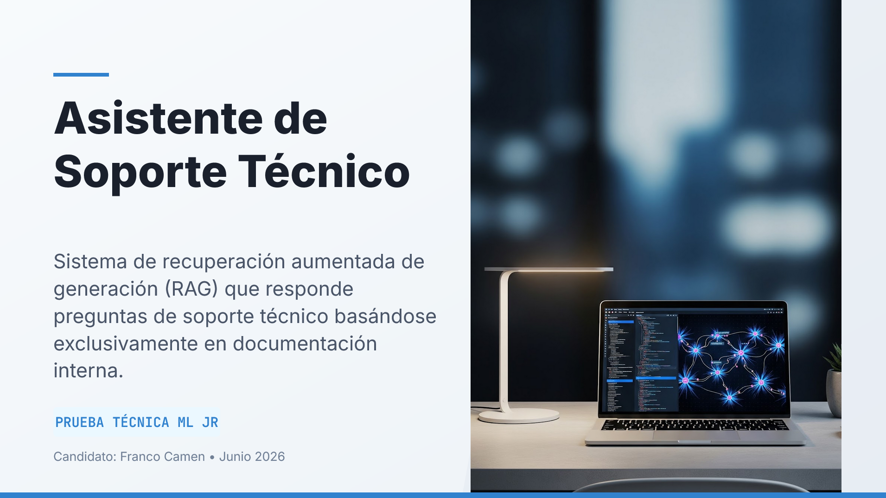

# Asistente de Soporte Tecnico con RAG y LLM

Proyecto de asistente de soporte tecnico basado en arquitectura RAG (Retrieval-Augmented Generation), desarrollado para responder preguntas utilizando documentacion interna como fuente de conocimiento. El sistema expone una API REST con FastAPI, procesa documentos en multiples formatos, genera embeddings locales, persiste el indice vectorial en ChromaDB y utiliza un modelo LLM para construir respuestas con fuentes.

## Descripcion general

El objetivo del proyecto fue construir un asistente capaz de responder consultas tecnicas a partir de documentacion interna, evitando respuestas inventadas y priorizando informacion recuperada desde archivos reales. Para esto se implemento un pipeline completo de ingesta, limpieza, chunking, embeddings, recuperacion semantica, reranking lexico y generacion de respuestas con LLM.

El sistema esta preparado para ser consultado directamente mediante API REST o a traves de un workflow en n8n, permitiendo integrarlo en flujos de soporte tecnico, automatizacion o autoservicio para usuarios internos.



## Arquitectura general

La arquitectura sigue un flujo RAG completo:

```text
Documentos internos
  -> loaders
  -> cleaner
  -> chunker
  -> embeddings
  -> ChromaDB

Usuario / n8n
  -> POST /query
  -> retriever semantico + reranking lexico
  -> contexto recuperado
  -> Gemini/OpenAI
  -> respuesta con fuentes
```

El sistema se ejecuta con Docker Compose e incluye dos servicios principales:

- **api:** aplicacion FastAPI con el pipeline RAG.
- **n8n:** workflow con Webhook para consultar la API y devolver respuestas formateadas.

## Funcionalidades principales

- Ingesta de documentacion interna en formatos `.txt`, `.md`, `.json` y `.pdf`.
- Limpieza y normalizacion de texto.
- Division de documentos en chunks.
- Generacion de embeddings locales con `sentence-transformers`.
- Persistencia del indice vectorial en ChromaDB.
- Recuperacion semantica de contexto relevante.
- Reranking lexico para mejorar coincidencias por palabras clave.
- Generacion de respuestas con Gemini API.
- Soporte opcional para OpenAI como proveedor LLM.
- Respuestas con fuentes, secciones y puntajes de relevancia.
- Endpoint de consulta para usuarios o integraciones.
- Workflow en n8n para exponer el asistente mediante Webhook.
- Endpoints de diagnostico para revisar chunks y recuperacion.
- Manejo controlado de errores y casos sin contexto suficiente.
- Tests automatizados para componentes clave del sistema.

## Ingesta de documentos

La ingesta procesa todos los archivos ubicados en la carpeta `docs/`. El pipeline soporta distintos formatos de documentacion:

- `.txt`
- `.md`
- `.json`
- `.pdf`

Durante la ingesta, el sistema:

1. Lee los documentos con loaders especificos.
2. Limpia y normaliza el texto.
3. Divide el contenido en fragmentos o chunks.
4. Genera embeddings locales.
5. Guarda el indice en ChromaDB dentro de `storage/chroma`.

Este proceso permite convertir documentacion dispersa en una base consultable semanticamente.

## Recuperacion y ranking

El asistente utiliza un enfoque hibrido para recuperar informacion relevante:

- **semantic_score:** similitud vectorial calculada mediante embeddings.
- **lexical_score:** coincidencia de palabras clave entre pregunta, seccion y texto.
- **score:** puntaje final utilizado para filtrar y ordenar los chunks.

Esta combinacion mejora la calidad de recuperacion, especialmente en consultas donde hay coincidencias textuales claras pero la similitud semantica por embeddings puede ser baja.

Tambien se incluyo un endpoint de diagnostico para revisar la recuperacion cruda, analizar candidatos, puntajes, fuentes y secciones recuperadas.

## Generacion de respuestas

Una vez recuperado el contexto, el sistema construye un prompt restrictivo para que el LLM responda utilizando solamente la informacion disponible en la documentacion.

El proveedor principal configurado es Gemini, usando `gemini-2.5-flash`. OpenAI queda disponible como alternativa mediante configuracion de entorno.

Cuando existe contexto suficiente, la respuesta incluye:

- respuesta generada;
- indicador `has_context=true`;
- fuentes utilizadas;
- tipo de archivo;
- seccion recuperada;
- puntajes de relevancia.

Si no se encuentra informacion suficiente, el sistema responde de forma controlada indicando que no hay contexto disponible, evitando inventar respuestas.

## API REST

La API fue desarrollada con FastAPI y expone endpoints para operar y diagnosticar el sistema.

Endpoints principales:

- `GET /health` - Verifica estado de la API y proveedor LLM configurado.
- `POST /ingest` - Ejecuta la ingesta de documentos.
- `POST /query` - Consulta al asistente.
- `GET /chunks` - Lista chunks indexados.
- `POST /debug/retrieve` - Muestra recuperacion cruda para una pregunta.

Tambien se dispone de documentacion interactiva en:

```text
http://localhost:8000/docs
```

## Integracion con n8n

El proyecto incluye un workflow exportado para n8n que permite consultar el asistente mediante un Webhook.

El flujo contiene:

```text
Webhook
  -> Prepare Question
  -> HTTP Request a http://api:8000/query
  -> Format API Response
  -> Respond to Webhook
```

Esta integracion permite exponer el asistente como parte de un flujo de automatizacion, conectarlo con otros sistemas o utilizarlo como canal de soporte tecnico.

## Manejo de errores

La API contempla distintos escenarios de error:

- Pregunta vacia.
- Indice vacio antes de ejecutar ingesta.
- Documentos invalidos o inexistentes.
- Error de embeddings o ChromaDB.
- API key invalida.
- Cuota agotada del proveedor LLM.
- Timeout del modelo.
- Falta de contexto relevante.

El manejo controlado de errores mejora la robustez del sistema y facilita su uso en escenarios reales.

## Testing

El proyecto incluye tests automatizados para validar componentes principales sin consumir creditos de Gemini u OpenAI.

Tests incluidos:

- `test_cleaner.py`
- `test_chunker.py`
- `test_loaders.py`
- `test_api.py`

Esto permite verificar limpieza, chunking, carga de documentos y comportamiento de endpoints principales.

## Tecnologias utilizadas

- Python
- FastAPI
- ChromaDB
- sentence-transformers
- Gemini API
- OpenAI API opcional
- n8n
- Docker
- Docker Compose
- Pytest
- PDFs, Markdown, JSON y TXT como fuentes documentales

## Decisiones tecnicas

- Uso de FastAPI para exponer endpoints REST simples y documentados.
- ChromaDB como vector store local persistente.
- Embeddings locales con `sentence-transformers/paraphrase-multilingual-MiniLM-L12-v2`, adecuados para consultas en espanol.
- Gemini como proveedor LLM principal por disponibilidad y costo.
- OpenAI como proveedor alternativo configurable.
- Prompt restrictivo para reducir alucinaciones.
- Respuestas con fuentes para mejorar trazabilidad.
- n8n como orquestador para integrar el asistente en flujos externos.
- Docker Compose para facilitar despliegue local reproducible.

## Valor del proyecto

Este proyecto me permitio implementar una solucion completa de IA aplicada al soporte tecnico, combinando backend, procesamiento de documentos, busqueda vectorial, LLMs, automatizacion y despliegue con Docker.

Tambien reforzo habilidades importantes para proyectos de IA en entornos reales: controlar fuentes, evitar respuestas inventadas, diagnosticar recuperacion, manejar errores, exponer APIs consumibles y conectar el sistema con herramientas de automatizacion como n8n.

El resultado es un asistente tecnico capaz de responder consultas con base documental, mostrar sus fuentes y servir como punto de partida para soluciones de soporte interno, mesa de ayuda, documentacion inteligente o autoservicio empresarial.

[Repositorio](https://github.com/FrancoCamen/Prueba-Tecnica-Franco-Camen.git)
