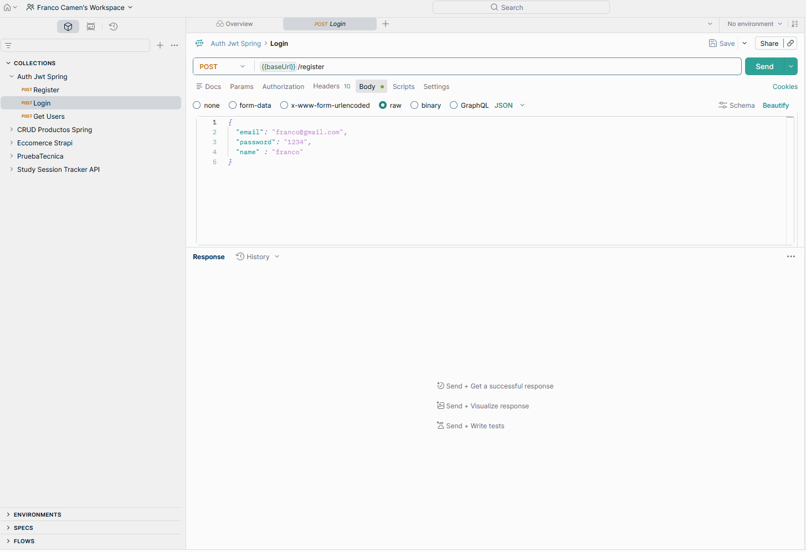

# Auth JWT API con Spring Boot

Mini proyecto backend desarrollado para comprender e implementar un flujo completo de autenticacion y autorizacion con JWT en Spring Boot. La API fue construida con Spring Boot 3, Spring Security 6, JPA y H2, y permite registrar usuarios, iniciar sesion, emitir tokens, proteger endpoints privados y revocar tokens almacenados en base de datos.

## Descripcion general

El objetivo principal del proyecto fue entender como funciona la autenticacion moderna basada en tokens dentro de una API REST. Para eso se implemento un flujo completo con `access_token`, `refresh_token`, validacion de Bearer Token por request y persistencia de tokens para poder controlar su revocacion.

El proyecto sirvio como practica especifica de seguridad backend, configuracion de Spring Security, manejo de filtros personalizados, generacion y validacion de JWT, proteccion de rutas privadas y buenas practicas para no exponer secretos en el codigo fuente.



## Funcionalidades principales

- Registro de usuarios.
- Login con email y password.
- Emision de `access_token` y `refresh_token`.
- Proteccion de endpoints privados mediante `Authorization: Bearer <token>`.
- Refresh de token para renovar credenciales.
- Persistencia de tokens en base de datos.
- Revocacion de tokens activos previos al iniciar sesion.
- Validacion de tokens expirados o revocados.
- Configuracion stateless con Spring Security.
- Uso de variables de entorno para secretos y configuracion.

## Arquitectura y organizacion

El proyecto se organizo separando responsabilidades entre autenticacion, seguridad, usuarios y persistencia.

La estructura principal incluye:

- **auth/controller:** endpoints publicos de autenticacion.
- **auth/service/AuthService:** logica de registro, login, refresh y revocacion.
- **auth/service/JwtService:** generacion, firma, parseo y validacion de JWT.
- **auth/entity/Token:** entidad para persistir tokens emitidos.
- **auth/repository/TokenRepository:** acceso a datos para consultar y actualizar tokens.
- **security/SecurityConfig:** reglas globales de seguridad.
- **security/JwtAuthFilter:** filtro que intercepta requests y valida Bearer Tokens.
- **usuario/controller/UserController:** endpoint protegido para probar autorizacion.

## Flujo de autenticacion

El flujo implementado permite que un cliente se registre o inicie sesion y reciba dos tokens:

- **Access token:** utilizado para acceder a endpoints protegidos.
- **Refresh token:** utilizado para solicitar un nuevo access token cuando el anterior expira.

Luego, el cliente envia el access token en el header:

```http
Authorization: Bearer <access_token>
```

El backend valida el token en cada request protegido antes de permitir el acceso al recurso.

## Validacion por request

La validacion se realiza mediante un filtro personalizado (`JwtAuthFilter`) registrado antes de `UsernamePasswordAuthenticationFilter`.

El filtro realiza los siguientes pasos:

- Lee el header `Authorization`.
- Extrae el token JWT.
- Verifica que el token exista en la base de datos.
- Comprueba que no este revocado ni expirado.
- Valida firma y expiracion mediante `JwtService`.
- Carga el usuario correspondiente.
- Setea la autenticacion en `SecurityContextHolder`.

Este mecanismo permite proteger endpoints de forma stateless, sin depender de sesiones HTTP tradicionales.

## Revocacion de tokens

Una parte importante del proyecto fue la persistencia de tokens en base de datos. Cada access token emitido se guarda con estados de control como `revoked` y `expired`.

Al iniciar sesion, el sistema revoca tokens previos activos del usuario. Esto permite tener mayor control sobre credenciales emitidas y simular escenarios reales de logout, renovacion y administracion de sesiones activas.

## Endpoints principales

### Publicos

- `POST /auth/register`
- `POST /auth/login`
- `POST /auth/refresh`
- `GET /h2-console/*`

### Protegidos

- `GET /users`

## Seguridad y configuracion

El proyecto evita hardcodear secretos dentro del codigo. La clave utilizada para firmar tokens (`JWT_SECRET`) se configura mediante variables de entorno y debe estar codificada en Base64.

Tambien se preparo un archivo `.env.example` como plantilla compartible, manteniendo `.env` fuera del control de versiones para evitar exponer credenciales sensibles.

## Tecnologias utilizadas

- Java 17
- Spring Boot 3
- Spring Security 6
- Spring Web
- Spring Data JPA
- H2 Database
- JJWT
- Lombok
- Maven
- JWT
- Variables de entorno

## Aprendizajes principales

- Configuracion de seguridad stateless con Spring Security.
- Diferencia entre `access_token` y `refresh_token`.
- Uso de filtros personalizados para validar tokens por request.
- Firma y validacion de JWT con clave secreta.
- Persistencia de tokens para permitir revocacion.
- Proteccion de endpoints privados con Bearer Token.
- Buenas practicas para manejar secretos mediante variables de entorno.

## Valor del proyecto

Este mini proyecto me permitio comprender de forma practica como se implementa autenticacion segura con JWT en una API REST construida con Spring Boot. Fue una base importante para luego aplicar autenticacion y autorizacion en proyectos mas grandes, como sistemas fullstack con usuarios, endpoints protegidos, seguridad por token y consumo desde frontend.

[Repositorio](https://github.com/FrancoCamen/AuthJwtSpring.git)
