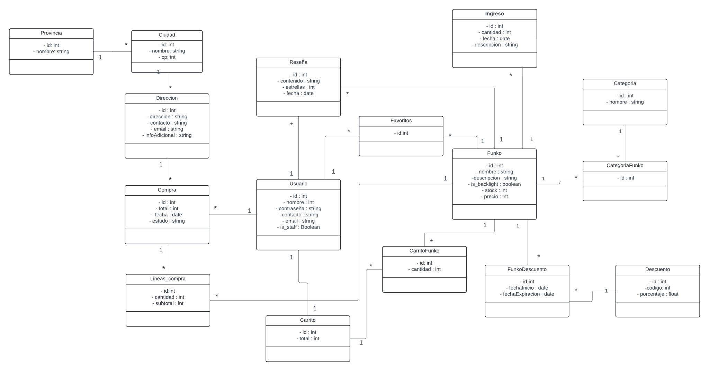

# Base de Datos E-commerce Funkopops con PostgreSQL

Proyecto de base de datos relacional para un sistema de e-commerce de Funkopops, desarrollado con PostgreSQL. El foco estuvo puesto especificamente en el analisis, diseno e implementacion de la base de datos desde cero, partiendo de reglas de negocio detalladas y llevando el dominio hasta un modelo relacional completo.

## Descripcion general

El proyecto consistio en disenar una base de datos para un e-commerce orientado a la venta de Funkopops. Se trabajaron reglas de negocio similares a las de una tienda online real: usuarios, productos, categorias, carritos, compras, stock, estados de compra y lineas de detalle.

El proceso comenzo con el analisis funcional de las reglas de negocio, continuo con la construccion de diagramas entidad-relacion, el pasaje al modelo relacional, la definicion del diccionario de datos y finalmente la implementacion en PostgreSQL. Ademas, se incorporaron triggers, vistas y procedimientos almacenados para automatizar reglas, validar datos y facilitar consultas analiticas.

## Objetivos del proyecto

- Modelar una base de datos relacional completa para un e-commerce.
- Traducir reglas de negocio en entidades, relaciones, restricciones y logica SQL.
- Aplicar buenas practicas de diseno relacional.
- Implementar validaciones automaticas mediante triggers.
- Crear vistas para analisis operativo y seguimiento de indicadores.
- Desarrollar procedimientos almacenados para consultar informacion relevante del negocio.

## Etapas realizadas

### Analisis de reglas de negocio

El punto de partida fue la definicion detallada de reglas de negocio del sistema. A partir de ellas se identificaron las entidades principales, sus atributos, relaciones, restricciones y comportamientos esperados.

Entre las reglas trabajadas se incluyeron:

- Gestion de usuarios.
- Productos Funkopop asociados a categorias.
- Control de stock.
- Creacion y gestion de carritos.
- Agregado de productos al carrito.
- Registro de compras.
- Lineas de compra.
- Estados de compra.
- Calculo de totales.
- Restricciones para evitar datos duplicados o inconsistentes.

### Diagrama entidad-relacion

Luego del analisis se construyo el Diagrama Entidad-Relacion, representando las entidades del dominio, sus atributos y las relaciones entre ellas. Esta etapa permitio visualizar la estructura conceptual del sistema antes de llevarla al modelo fisico.

El DER sirvio como base para validar cardinalidades, dependencias y reglas principales entre usuarios, productos, categorias, carritos, compras y detalles de compra.

### Pasaje a modelo relacional

A partir del DER se realizo el pasaje al modelo relacional, definiendo tablas, claves primarias, claves foraneas, restricciones y relaciones entre entidades.

Este paso permitio transformar el modelo conceptual en una estructura implementable en PostgreSQL, cuidando la integridad referencial y la normalizacion de los datos.

### Diccionario de datos

Se elaboro un diccionario de datos para documentar las tablas, columnas, tipos de datos, claves, restricciones y significado de cada campo.

Esta documentacion permitio dejar claro el proposito de cada entidad y atributo, facilitando el mantenimiento, la comprension del modelo y la comunicacion tecnica del diseno.

## Implementacion en PostgreSQL

La implementacion incluyo la creacion de tablas, relaciones, restricciones, triggers, views y procedimientos almacenados. El objetivo fue que parte de la logica de negocio quedara automatizada dentro de la propia base de datos, manteniendo consistencia e integridad sin depender exclusivamente de una capa de aplicacion.

## Triggers y reglas de negocio

Se implementaron triggers para aplicar reglas de negocio complejas y automatizar comportamientos criticos del sistema.

Algunos de los triggers desarrollados fueron:

- **Validacion de stock:** control automatico para impedir operaciones que superen la cantidad disponible de productos.
- **Usuario unico:** validacion para evitar usuarios duplicados y mantener consistencia en los datos de registro.
- **Agregar Funko al carrito:** logica para incorporar productos al carrito respetando reglas de cantidad, disponibilidad y relacion con el usuario.
- **Creacion automatica de carrito:** al crear un usuario, se genera automaticamente su carrito asociado.
- **Creacion previa de compra:** antes de insertar lineas de compra, se crea la compra con valores iniciales/default.
- **Actualizacion de totales:** despues de crear las lineas de compra, se completan o actualizan los datos de la compra, como el total final.

Estos triggers permitieron automatizar validaciones y mantener consistencia transaccional dentro del flujo de compra.

## Views

Se crearon vistas para facilitar consultas frecuentes y analisis del negocio sin tener que reescribir consultas complejas.

Algunas vistas implementadas fueron:

- **Stocks criticos:** identificacion de productos con bajo stock para apoyar decisiones de reposicion.
- **Estadisticas por categoria:** resumen de informacion agrupada por categorias de productos.
- **Consultas de seguimiento comercial:** vistas orientadas a analizar productos, categorias, compras y comportamiento operativo del e-commerce.

Las views permiten disponer de informacion preparada para reportes, dashboards o analisis posteriores.

## Procedimientos almacenados

Tambien se desarrollaron procedimientos almacenados para encapsular consultas y operaciones relevantes del negocio.

Entre ellos:

- **Obtener total de ventas:** calculo del monto total vendido en el sistema.
- **Obtener compras por estado:** consulta de compras agrupadas o filtradas segun su estado.
- **Consultas operativas:** procedimientos orientados a recuperar informacion clave para seguimiento de compras, ventas y rendimiento del e-commerce.

El uso de procedimientos almacenados ayudo a centralizar logica SQL reutilizable y facilitar el acceso a informacion importante del negocio.

## Tecnologias utilizadas

- PostgreSQL
- SQL
- Diagramas entidad-relacion
- Modelo relacional
- Diccionario de datos
- Triggers
- Views
- Stored procedures

## Valor del proyecto

Este proyecto me permitio profundizar en el diseno e implementacion de bases de datos relacionales, partiendo desde reglas de negocio hasta una solucion completa en PostgreSQL. Fue una experiencia clave para practicar modelado de datos, normalizacion, integridad referencial, automatizacion de reglas mediante triggers y construccion de consultas reutilizables mediante views y procedimientos almacenados.

Tambien reforzo mi capacidad para traducir necesidades funcionales de un sistema en estructuras de datos concretas, manteniendo foco en consistencia, trazabilidad y soporte a la toma de decisiones.

[Documentacion](https://drive.google.com/drive/folders/1fIXMa3SwontLx9T3DoLLCCHUiyWidTYH?usp=sharing)
