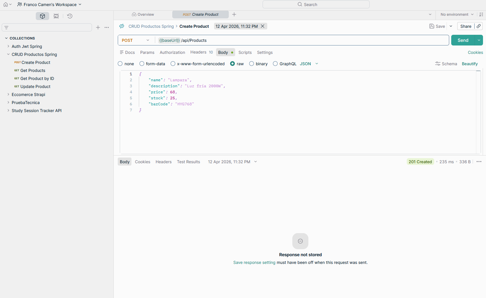

# API REST CRUD de Productos con Spring Boot

Mini proyecto backend desarrollado para afianzar los fundamentos del desarrollo de APIs REST con Spring Boot, Spring Data JPA y arquitectura en capas. La aplicacion implementa un CRUD completo para la gestion de productos, utilizando DTOs, validaciones declarativas, manejo global de excepciones y persistencia en base de datos H2.

## Descripcion general

El objetivo del proyecto fue practicar la construccion de una API REST simple pero bien organizada, priorizando la comprension de cada capa de una aplicacion backend. Aunque el dominio es acotado, la implementacion incorpora buenas practicas habituales en proyectos reales: separacion de responsabilidades, desacoplamiento entre entidades y respuestas de API, validacion de datos de entrada y respuestas de error consistentes.

El proyecto fue desarrollado como ejercicio de aprendizaje guiado, con foco en entender como se conectan controladores, servicios, repositorios, entidades, DTOs y excepciones dentro de una aplicacion Spring Boot.

## Funcionalidades principales

- Crear productos.
- Listar todos los productos.
- Obtener un producto por ID.
- Actualizar productos existentes.
- Eliminar productos.
- Validar datos de entrada antes de ejecutar la logica de negocio.
- Responder errores de forma centralizada y consistente.
- Registrar automaticamente fechas de creacion y actualizacion.
- Probar endpoints mediante Postman, Insomnia o Thunder Client.

## Arquitectura en capas

La aplicacion fue organizada siguiendo una arquitectura en capas, separando claramente las responsabilidades de cada componente.

Las capas principales son:

- **Controller:** recibe peticiones HTTP, expone endpoints REST y devuelve respuestas JSON.
- **Service:** contiene la logica de negocio y orquesta las operaciones.
- **Repository:** abstrae el acceso a datos mediante Spring Data JPA.
- **Entity:** representa la tabla de productos en la base de datos.
- **DTOs:** definen los objetos de entrada y salida de la API.
- **Exception handling:** centraliza el manejo de errores y respuestas HTTP.

Esta separacion permite que el codigo sea mas mantenible, testeable y facil de evolucionar.

## Uso de DTOs

Se implementaron DTOs para separar la estructura interna de la entidad `Producto` de los datos expuestos por la API.

Los DTOs principales son:

- **ProductoRequest:** utilizado para crear o actualizar productos.
- **ProductoResponse:** utilizado para devolver informacion al cliente.

Este enfoque permite:

- Desacoplar la API del modelo interno de base de datos.
- Controlar que campos pueden ser enviados por el cliente.
- Evitar problemas de asignacion masiva.
- Ocultar campos internos o de auditoria.
- Mantener contratos de API mas claros.

## Validaciones declarativas

El proyecto utiliza Jakarta Bean Validation para validar los datos de entrada antes de que lleguen a la logica de negocio.

Algunas validaciones aplicadas incluyen:

- Campos obligatorios.
- Textos no vacios.
- Longitudes maximas o minimas.
- Valores numericos positivos.
- Restricciones sobre precio u otros atributos del producto.

Esto permite prevenir datos invalidos y responder con errores claros cuando una peticion no cumple las reglas definidas.

## Manejo global de excepciones

Se implemento un manejador global de errores con `@RestControllerAdvice`, centralizando las respuestas ante excepciones.

El sistema contempla errores como:

- **400 Bad Request:** errores de validacion en campos de entrada.
- **404 Not Found:** producto inexistente o recurso no encontrado.
- **500 Internal Server Error:** errores inesperados del servidor.

Tambien se definio una estructura de respuesta de error para que la API devuelva mensajes consistentes y faciles de interpretar.

## Auditoria automatica

La entidad de producto incorpora manejo automatico de fechas mediante anotaciones JPA como `@PrePersist` y `@PreUpdate`.

Esto permite registrar:

- Fecha de creacion.
- Fecha de ultima actualizacion.

La auditoria queda automatizada dentro del ciclo de vida de la entidad, evitando cargar manualmente esos valores desde el servicio.

## Endpoints principales

| Metodo | Endpoint             | Descripcion                    |
| ------ | -------------------- | ------------------------------ |
| POST   | `/api/products`      | Crear un nuevo producto        |
| GET    | `/api/products`      | Obtener todos los productos    |
| GET    | `/api/products/{id}` | Obtener un producto por ID     |
| PUT    | `/api/products/{id}` | Actualizar un producto         |
| DELETE | `/api/products/{id}` | Eliminar un producto existente |

## Base de datos

Para el entorno de desarrollo se utilizo H2 Database en memoria. Esto permite ejecutar el proyecto rapidamente, probar los endpoints y revisar los datos desde la consola H2 sin necesidad de configurar una base externa.

La persistencia se implemento con Spring Data JPA e Hibernate, utilizando repositorios para abstraer operaciones CRUD sobre la entidad `Producto`.

## Tecnologias utilizadas

- Java 17+
- Spring Boot 3
- Spring Web
- Spring Data JPA
- Hibernate
- H2 Database
- Jakarta Bean Validation
- Maven
- Postman / Insomnia / Thunder Client

## Aprendizajes principales

- Construccion de endpoints REST con Spring Boot.
- Aplicacion de arquitectura en capas.
- Uso de Spring Data JPA para persistencia.
- Implementacion de DTOs de entrada y salida.
- Validacion declarativa con Jakarta Validation.
- Manejo global de excepciones con `@RestControllerAdvice`.
- Uso de H2 para pruebas locales.
- Auditoria automatica con callbacks JPA.

## Valor del proyecto

Este mini proyecto me permitio reforzar los fundamentos del desarrollo backend con Spring Boot desde una base clara y bien estructurada. Fue util para comprender como organizar una API REST mantenible, separar responsabilidades, validar informacion, manejar errores correctamente y exponer operaciones CRUD siguiendo buenas practicas.

Aunque se trata de un proyecto pequeno, funciona como base tecnica para aplicaciones mas complejas que requieren entidades, reglas de validacion, persistencia, servicios y endpoints REST ordenados.

[Repositorio](https://github.com/FrancoCamen/CRUD_Springboot.git)
