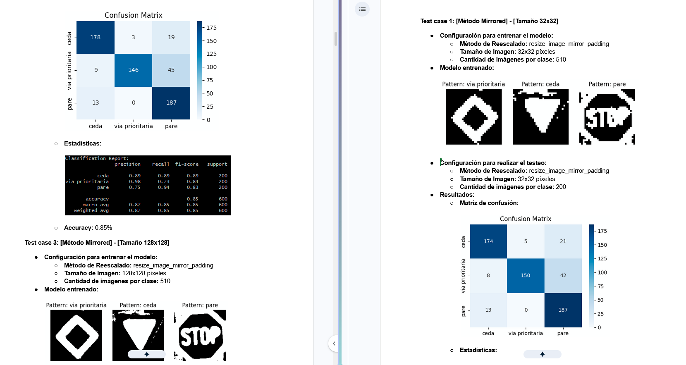

# Clasificador de Senales de Transito con Red Neuronal de Hamming

Proyecto academico de Inteligencia Artificial desarrollado en equipo para clasificar imagenes de senales de transito mediante una Red Neuronal de Hamming. El sistema fue implementado en Python y reconoce tres clases: Pare, Ceda el Paso y Via Prioritaria.

Mi responsabilidad principal dentro del proyecto fue el diseno y ejecucion del proceso de testeo, la definicion de metricas, la comparacion de configuraciones y la caracterizacion de los limites operativos del modelo.




## Descripcion general

El sistema recibe imagenes previamente recortadas y las clasifica comparandolas con patrones representativos aprendidos para cada clase. No funciona como detector de objetos en tiempo real: presupone que la imagen de entrada contiene una senal completa y se encuentra preparada para su procesamiento.

El flujo general es:

```text
Imagen recortada
  -> validacion y redimensionamiento
  -> escala de grises
  -> ecualizacion de histograma
  -> binarizacion con Otsu
  -> vectorizacion en valores -1 y 1
  -> comparacion por distancia de Hamming
  -> clase predicha
  -> evaluacion de metricas
```

El entrenamiento genera un patron promedio para cada clase a partir de sus imagenes de ejemplo. Durante la clasificacion, se calcula la distancia de Hamming entre la imagen procesada y cada uno de esos patrones; la etiqueta asignada corresponde al prototipo con menor distancia.

## Objetivos

- Implementar una Red Neuronal de Hamming para clasificacion de imagenes.
- Evaluar diferentes estrategias de preprocesamiento.
- Determinar el tamano de entrada y el conjunto de entrenamiento mas adecuados.
- Medir el rendimiento mediante metricas estandarizadas.
- Analizar la robustez frente a rotacion, escalado, traslacion e inversion.
- Identificar condiciones de fallo y limites de uso del modelo.
- Documentar un proceso experimental reproducible.

## Preprocesamiento de imagenes

Antes de ingresar a la red, cada imagen atraviesa las siguientes etapas:

- Validacion del tamano configurado.
- Conversion a escala de grises.
- Ecualizacion de histograma para mejorar el contraste.
- Binarizacion automatica mediante el metodo de Otsu.
- Redimensionamiento segun la configuracion evaluada.
- Vectorizacion de pixeles utilizando valores `-1` y `1`.

Durante las pruebas se compararon tres metodos de redimensionamiento:

- `Mirrored`: relleno mediante reflejo de la imagen.
- `Blurred`: fondo ampliado y desenfocado.
- `Stretched`: estiramiento de la imagen al tamano objetivo.

Cada metodo fue evaluado con resoluciones de 32x32, 64x64 y 128x128 pixeles.

## Gestion de entradas y resultados

El sistema utiliza archivos CSV para administrar la ejecucion de las pruebas:

- `datainput.csv` contiene las imagenes a procesar y sus etiquetas reales.
- `dataoutput.csv` registra la etiqueta real y la clase predicha por el modelo.

El script de metricas lee los resultados generados, calcula los indicadores de evaluacion e informa el comportamiento global y por clase.

## Mi rol: metricas y testeo

Mi trabajo se concentro en disenar una metodologia que permitiera comparar las configuraciones bajo condiciones controladas y comprender no solo cuanto acertaba el modelo, sino tambien como y por que fallaba.

Las principales tareas fueron:

- Definicion del protocolo de evaluacion.
- Seleccion y fundamentacion de las metricas.
- Preparacion de datasets de entrenamiento y prueba.
- Ejecucion y documentacion de 35 casos de prueba.
- Comparacion de metodos de redimensionamiento y resoluciones.
- Analisis del impacto de la cantidad y variedad de imagenes de entrenamiento.
- Diseno de pruebas de robustez frente a condiciones adversas.
- Generacion e interpretacion de matrices de confusion.
- Analisis de resultados por clase.
- Identificacion de puntos de ruptura y limitaciones operativas.
- Documentacion de conclusiones y configuracion recomendada.

## Metricas de evaluacion

Se utilizo la matriz de confusion como base para analizar verdaderos positivos, falsos positivos, verdaderos negativos y falsos negativos.

Las metricas seleccionadas fueron:

- **Accuracy:** proporcion total de predicciones correctas.
- **Precision:** confiabilidad de las predicciones positivas para cada clase.
- **Recall:** capacidad de recuperar todas las instancias reales de una clase.
- **F1-score:** balance entre Precision y Recall.

El Recall se considero especialmente importante por tratarse de senales de transito, donde un falso negativo puede representar un error mas critico. El F1-score se utilizo como indicador principal para comparar configuraciones, mientras que Accuracy funciono como medida global de referencia.

Las metricas y matrices de confusion se generaron con Pandas, Scikit-learn, Matplotlib y Seaborn.

## Etapa 1: optimizacion del preprocesamiento

La primera etapa comparo nueve combinaciones entre los metodos Mirrored, Blurred y Stretched y los tamanos 32x32, 64x64 y 128x128.

Para mantener condiciones comparables:

- se entreno con 510 imagenes por clase;
- se utilizaron 17 senales fisicas con 30 perspectivas y resoluciones;
- se evaluo con 200 imagenes por clase, 600 en total.

Los metodos Stretched obtuvieron los mejores resultados globales. Las configuraciones 32x32 y 128x128 alcanzaron aproximadamente un 89% de Accuracy. Se selecciono Stretched 32x32 porque ofrecia un rendimiento equivalente con menor costo computacional.

## Etapa 2: impacto del dataset de entrenamiento

La segunda etapa analizo como afectaban al modelo la cantidad de senales fisicas y la variedad de perspectivas. Se mantuvo la configuracion Stretched 32x32 y se ejecutaron catorce combinaciones adicionales.

El mejor resultado se obtuvo con:

- 50 senales fisicas diferentes por clase;
- una perspectiva y resolucion por senal;
- 200 imagenes de prueba por clase.

Resultados de la configuracion seleccionada:

| Metrica | Resultado |
|---|---:|
| Accuracy | 91% |
| Precision | 92% |
| Recall | 91% |
| F1-score | 91% |

El analisis demostro que agregar mas imagenes no mejoraba el rendimiento de forma lineal. A partir de cierto punto, el patron promedio perdia capacidad discriminativa y la Accuracy disminuia. Este resultado permitio seleccionar la configuracion por evidencia experimental y no solamente por volumen de datos.

## Pruebas de robustez

Una vez definida la configuracion optima, se disenaron pruebas de esfuerzo para comprender el comportamiento del sistema fuera de las condiciones ideales.

### Rotacion

Se evaluaron imagenes rotadas 5, 10, 20, 40, 80 y 160 grados, superpuestas sobre fondos realistas.

- A 5 grados, el modelo alcanzo 92% de Accuracy.
- Hasta 20 grados mantuvo un rendimiento igual o superior al 86%.
- Pare y Ceda conservaron un Recall alto incluso con rotaciones de hasta 40 grados.
- Via Prioritaria presento una degradacion mayor debido a la fragilidad geometrica de su patron.

### Escalado

Se redujo progresivamente el area ocupada por la senal:

- Con una ocupacion del 75%, la Accuracy fue del 70%.
- Con una ocupacion del 50%, descendio al 46%.
- Con una ocupacion del 25%, cayo al 33%, equivalente al azar para tres clases.

### Traslacion

Las senales fueron ubicadas en diferentes esquinas de la imagen para evaluar la sensibilidad a la posicion.

La Accuracy descendio a valores entre 35% y 43%. El analisis de la matriz de confusion revelo un fallo sistematico: el preprocesamiento generaba un patron dominado por el fondo y el modelo tendia a clasificar las entradas como Ceda.

### Inversion vertical

La prueba permitio comprobar que el efecto dependia de la simetria de cada senal:

- Pare mantuvo un Recall del 99%.
- Via Prioritaria obtuvo un Recall del 75%.
- Ceda descendio a un Recall del 41%.

Esto mostro que el modelo reconoce principalmente patrones geometricos y que es sensible a la orientacion cuando la forma no es simetrica.

## Resultados y limitaciones

La configuracion final recomendada fue:

- metodo de redimensionamiento Stretched;
- resolucion de 32x32 pixeles;
- 50 imagenes fisicas distintas por clase;
- una perspectiva y resolucion por imagen.

Con esta configuracion, el clasificador alcanzo 91% de Accuracy en el conjunto de prueba controlado.

El proceso de testeo tambien permitio establecer que:

- el modelo tolera rotaciones leves, aunque el resultado depende de la geometria de cada clase;
- no es invariante a la posicion;
- pierde confiabilidad cuando la senal ocupa una parte pequena de la imagen;
- requiere entradas recortadas, completas y centradas;
- no debe presentarse como un detector de objetos en tiempo real.

## Tecnologias utilizadas

- Python 3
- NumPy
- OpenCV
- Pandas
- Scikit-learn
- Matplotlib
- Seaborn
- Pillow
- Procesamiento digital de imagenes
- Redes neuronales de Hamming
- Matrices de confusion
- Testing de modelos de clasificacion

## Valor del proyecto

Este proyecto me permitio aplicar una metodologia experimental completa sobre un modelo de Inteligencia Artificial. Mi aporte se enfoco en transformar resultados de ejecucion en evidencia medible, comparar alternativas, justificar decisiones y documentar las condiciones en las que el sistema funciona o falla.

Ademas de trabajar con metricas de clasificacion, incorpore practicas transferibles a QA de modelos y Machine Learning: diseno de casos de prueba, preparacion controlada de datasets, pruebas de robustez, analisis de falsos positivos y falsos negativos, deteccion de sesgos por clase y comunicacion clara de limitaciones.

[Documentacion](https://drive.google.com/drive/folders/1tsg4fePc19hc5sV5MZD8F4EHGkgtM71x?usp=sharing)
