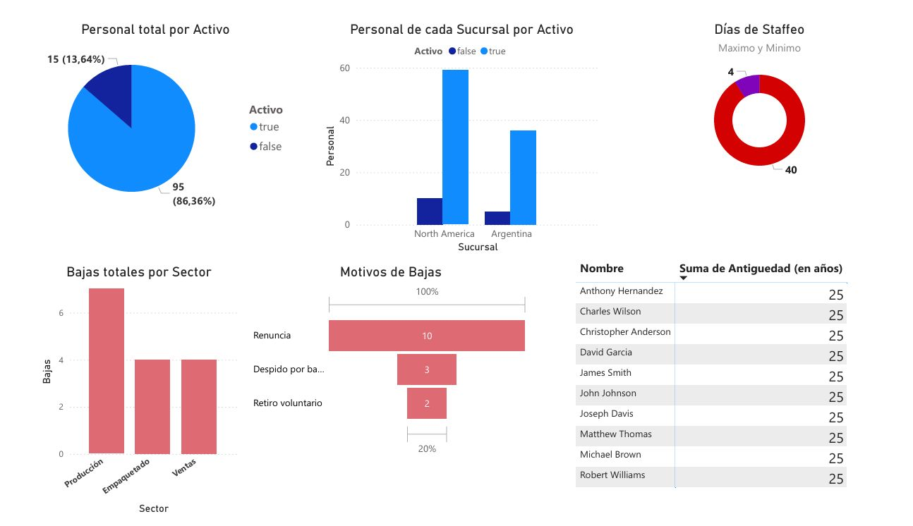

# Data Warehouse y Business Intelligence - Market Wine

Proyecto integrador de Data Warehouse y Business Intelligence desarrollado para el caso "Market Wine", con foco en consolidar informacion de personal de distintas sucursales y construir analisis para apoyar decisiones estrategicas de talento, rotacion, costos, staffeo y desempeno.

## Descripcion general

El proyecto consistio en relevar, limpiar, transformar y consolidar distintas fuentes de datos relacionadas con empleados de la empresa Market Wine. A partir de esas fuentes se diseno un proceso ETL, se prepararon tablas analiticas y se construyeron dashboards en Power BI para responder preguntas de negocio vinculadas a recursos humanos.

El trabajo tuvo un enfoque completo de BI: identificacion de fuentes, deteccion de inconsistencias, transformacion de datos, carga en base de datos, preparacion de indicadores, visualizacion y generacion de conclusiones/recomendaciones basadas en datos.

## Objetivo del proyecto

El objetivo principal fue construir una solucion de Data Warehouse y BI que permita analizar la situacion del personal de la empresa, considerando empleados activos e inactivos, distribucion por sucursal, rotacion por sector, motivos de baja, tiempos de staffeo y antiguedad.

La solucion busco transformar datos dispersos y heterogeneos en informacion confiable para la toma de decisiones.

## Fuentes de datos

Se trabajaron tres fuentes principales:

- **Personal.csv:** informacion de empleados de Argentina, incluyendo nombre, sector, fecha de nacimiento, edad, fecha de alta, puesto, antiguedad, sueldo, motivo de baja, fecha de baja, proceso de staffeo y dias de staffeo.
- **Equipos.csv:** relacion entre empleados, sector y equipo de trabajo.
- **BD_sucursal_North_America.txt:** script SQL con creacion e insercion de datos de empleados de la sucursal North America.

La fuente de North America fue cargada en una base PostgreSQL para luego ser consumida desde el proceso ETL.

## Problemas e inconsistencias detectadas

Durante el relevamiento se identificaron distintas inconsistencias entre las fuentes:

- Columna de antiguedad duplicada en `Personal.csv`.
- Falta de columna `Activo` en una de las fuentes.
- Diferencias de nomenclatura entre equipos, por ejemplo `Equipo Y` y `Team X`.
- Sueldos expresados en distintas monedas entre fuentes.
- Diferencias en nombres de columnas entre CSV y base SQL.
- Columnas faltantes en la fuente de North America.
- Necesidad de agregar una columna de sucursal para unificar empleados de Argentina y North America.

Esta etapa fue importante para entender la calidad de los datos antes de construir indicadores y dashboards.

## Proceso ETL

El proceso ETL fue desarrollado con RapidMiner, integrando datos desde archivos CSV y desde una base PostgreSQL.

### Extraccion

Para los archivos CSV se utilizo el operador `Read CSV`, configurando delimitador, encoding y formato de fechas.

Para la informacion de North America se levanto una base PostgreSQL, se creo una tabla llamada `talento` y se cargaron los registros desde el script SQL. Luego se utilizo `Read Database` para incorporar esa informacion al flujo ETL.

### Transformacion

La transformacion se trabajo en dos ramas principales: empleados de Argentina y empleados de North America. Luego ambas ramas fueron unificadas.

Para Argentina:

- Se realizo un `Inner Join` entre `Personal.csv` y `Equipos.csv` mediante la columna `Nombre`.
- Se elimino la columna duplicada de antiguedad.
- Se generaron atributos nuevos como `Sucursal`, `Activo` y antiguedad recalculada.

Para North America:

- Se renombraron columnas para unificar la estructura con Argentina.
- Se calcularon atributos faltantes como antiguedad.
- Se agrego la columna `Sucursal` con valor `North America`.
- Se normalizaron valores booleanos de `Activo`.
- Se unifico la nomenclatura de equipos.

Finalmente, se utilizo `Union` para consolidar ambas tablas en una tabla completa de personal.

### Carga

Las tablas resultantes fueron preparadas segun las preguntas de negocio y cargadas mediante `Write Database`, dejando la informacion lista para ser consumida desde Power BI.

## Preguntas de negocio analizadas

El proyecto respondio preguntas clave relacionadas con talento y recursos humanos:

- Cantidad total de personal clasificado por estado activo/inactivo.
- Cantidad de personal por sucursal, clasificado por activo.
- Sector mas afectado por la rotacion.
- Tiempo maximo y minimo de staffeo.
- Motivo de baja mas frecuente.
- Colaboradores con mayor antiguedad.

Cada pregunta fue resuelta mediante transformaciones, agregaciones, filtros, ordenamientos y preparacion de datasets especificos.

## Dashboards en Power BI

Se construyeron dashboards en Power BI para representar los indicadores preparados durante el proceso ETL.

Los graficos permitieron analizar:

- Distribucion de empleados activos e inactivos.
- Comparacion de personal por sucursal.
- Rotacion por sector.
- Motivos de baja.
- Variabilidad en dias de staffeo.
- Empleados con mayor antiguedad.

Ademas de visualizar datos, se elaboraron interpretaciones, conclusiones y recomendaciones estrategicas basadas en los resultados.

## Hallazgos principales

Entre los principales resultados del analisis se observaron:

- La empresa presentaba una tasa alta de empleados activos, con una situacion general saludable de retencion.
- North America concentraba mayor cantidad de empleados que Argentina.
- Produccion aparecia como el sector mas afectado por la rotacion.
- La renuncia voluntaria era el motivo de baja mas frecuente.
- Existia una gran variabilidad en los tiempos de staffeo, mostrando oportunidad de estandarizacion.
- Un grupo de empleados con alta antiguedad representaba tanto un activo de conocimiento como un riesgo ante futuras salidas o jubilaciones.

## Recomendaciones generadas

A partir del analisis se propusieron recomendaciones como:

- Estandarizar procesos de staffeo y reducir tiempos maximos.
- Investigar causas de rotacion en el sector Produccion.
- Implementar acciones de retencion y encuestas de clima laboral.
- Monitorear bajas por sucursal y sector.
- Crear programas de transferencia de conocimiento con empleados de mayor antiguedad.
- Mantener dashboards de seguimiento continuo para detectar alertas tempranas.

## Tecnologias y herramientas utilizadas

- RapidMiner
- Power BI
- PostgreSQL
- SQL
- CSV
- Procesos ETL
- Data Warehouse
- Modelado y limpieza de datos
- Dashboards e indicadores
- Analisis de datos aplicado a recursos humanos

## Valor del proyecto

Este proyecto me permitio practicar el ciclo completo de una solucion BI: desde el relevamiento de fuentes y problemas de calidad de datos hasta la construccion de tableros y recomendaciones para negocio.

Tambien reforzo mi capacidad para trabajar con fuentes heterogeneas, normalizar estructuras, construir procesos ETL, preparar datos para analisis y comunicar hallazgos de forma clara. Fue una experiencia importante para vincular conocimientos tecnicos de bases de datos con necesidades reales de toma de decisiones.

[Documentacion](https://docs.google.com/document/d/1NrvSd01dOnWWyaSMUYivtwjFuGq7Rm9Cze4jnZnTKi0/edit?usp=sharing)
