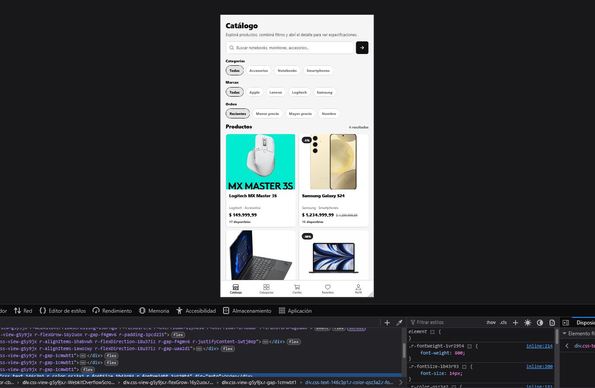

# E-commerce Mobile con Expo y Strapi

Proyecto academico fullstack de e-commerce tecnologico compuesto por una aplicacion mobile desarrollada con Expo y React Native, y un backend headless construido con Strapi. El sistema permite navegar un catalogo, buscar y filtrar productos, gestionar favoritos y carrito, autenticarse, realizar un checkout simulado y consultar el historial de ordenes.

## Descripcion general

El proyecto fue desarrollado para implementar el flujo completo de una aplicacion de comercio electronico, combinando una experiencia mobile multiplataforma con una API REST y un panel de administracion de contenidos.

La arquitectura se divide en:

```text
Aplicacion mobile
Expo + React Native + TypeScript
              |
              | API REST + JWT
              v
       Strapi v4
              |
              v
           SQLite
```

Strapi administra los productos, categorias, marcas, favoritos, ordenes, usuarios y archivos multimedia. El frontend consume la API desde servicios tipados y mantiene separados los componentes visuales, contextos, hooks, almacenamiento local y modelos de dominio.




## Objetivos del proyecto

- Construir una aplicacion de e-commerce mobile multiplataforma.
- Integrar Expo y React Native con un backend headless.
- Consumir y extender la API REST generada por Strapi.
- Implementar autenticacion y autorizacion mediante JWT.
- Aplicar reglas de negocio del lado del servidor.
- Gestionar estados globales y persistencia local en el frontend.
- Proteger informacion y operaciones pertenecientes a cada usuario.
- Desarrollar una interfaz consistente con estados de carga, error y contenido vacio.

## Funcionalidades principales

### Catalogo de productos

- Listado de productos activos.
- Busqueda por nombre.
- Filtros por categoria y marca.
- Ordenamiento por fecha, precio y nombre.
- Paginacion de resultados.
- Navegacion por categorias.
- Vista de detalle de producto.
- Galeria de imagenes.
- Visualizacion de precio, descuento, stock y especificaciones.

Las imagenes de productos, los iconos de categorias y los logos de marcas se administran mediante la Media Library de Strapi.

### Autenticacion

- Registro con nombre de usuario, correo y contrasena.
- Inicio de sesion mediante Strapi Users & Permissions.
- Autenticacion basada en JWT.
- Persistencia segura del token con Expo SecureStore.
- Restauracion automatica de la sesion.
- Cierre de sesion desde el perfil.
- Proteccion de rutas que requieren un usuario autenticado.

### Favoritos

- Agregar o quitar productos desde su pantalla de detalle.
- Consultar los favoritos del usuario.
- Evitar asociaciones duplicadas.
- Restringir la consulta y eliminacion a los registros del usuario autenticado.
- Mantener el estado sincronizado mediante un contexto global.

### Carrito

- Agregar productos desde el detalle.
- Modificar cantidades.
- Eliminar productos.
- Validar cantidades contra el stock conocido.
- Calcular subtotal, descuentos y total.
- Persistir el carrito localmente mediante AsyncStorage.

### Checkout y ordenes

- Creacion simulada de ordenes desde la aplicacion.
- Recalculo de precios y descuentos en el backend.
- Validacion de stock durante la operacion.
- Descuento de existencias al confirmar una orden.
- Almacenamiento de un snapshot de los productos comprados.
- Consulta del historial de ordenes del usuario autenticado.

Los totales enviados por el cliente no son considerados confiables. Strapi consulta los productos y vuelve a calcular los importes antes de registrar la compra, evitando que los valores puedan ser manipulados desde el frontend.

## Reglas de negocio

- Los productos con `isActive = false` no se muestran en el catalogo.
- La eliminacion de productos utiliza soft delete.
- Los precios, descuentos y totales de una orden se calculan en el servidor.
- El stock se valida y actualiza al crear la orden.
- Cada favorito pertenece a un usuario y un producto.
- No se permiten favoritos duplicados.
- Los usuarios solo pueden consultar o eliminar sus propios favoritos.
- Cada usuario accede unicamente a su historial de ordenes.
- Las acciones protegidas requieren un JWT valido.

## Backend con Strapi

El backend fue desarrollado con Strapi v4 y utiliza SQLite como base de datos.

Content types principales:

- `Product`
- `Category`
- `Brand`
- `Favorite`
- `Order`

Tambien se creo el componente reutilizable `order.item`, utilizado para guardar el detalle de los productos de una orden.

El backend incluye:

- relaciones entre entidades;
- controladores personalizados;
- filtros por usuario autenticado;
- validaciones de negocio;
- manejo de permisos publicos y autenticados;
- carga inicial de categorias, marcas y productos;
- administracion de contenido y archivos multimedia;
- documentacion de endpoints;
- guia de pruebas con Postman.

## API REST

Los principales endpoints son:

| Metodo | Ruta | Acceso | Funcion |
|---|---|---|---|
| `GET` | `/products` | Publico | Listar productos activos |
| `GET` | `/products/:id` | Publico | Consultar un producto |
| `GET` | `/categories` | Publico | Listar categorias |
| `GET` | `/brands` | Publico | Listar marcas |
| `POST` | `/auth/local/register` | Publico | Registrar un usuario |
| `POST` | `/auth/local` | Publico | Iniciar sesion |
| `GET` | `/favorites` | Autenticado | Consultar favoritos propios |
| `POST` | `/favorites` | Autenticado | Agregar un favorito |
| `DELETE` | `/favorites/:id` | Autenticado | Eliminar un favorito propio |
| `GET` | `/orders` | Autenticado | Consultar historial propio |
| `POST` | `/orders` | Autenticado | Crear una orden |

## Frontend con Expo

El frontend fue desarrollado con Expo SDK 54, React Native, Expo Router y TypeScript en modo estricto.

Las pantallas principales son:

- catalogo;
- categorias;
- detalle de producto;
- carrito y checkout;
- favoritos;
- perfil;
- login;
- registro;
- historial de ordenes.

La navegacion principal utiliza tabs, mientras que Expo Router organiza las rutas a partir de la estructura de archivos y permite manejar pantallas dinamicas como `product/[id]`.

## Arquitectura del frontend

El codigo se organizo en capas con responsabilidades definidas:

- `app/`: rutas y pantallas.
- `components/`: componentes visuales reutilizables.
- `constants/`: configuracion general y paleta.
- `context/`: estados globales de autenticacion, carrito y favoritos.
- `hooks/`: acceso a contextos y logica reutilizable.
- `services/`: cliente HTTP y servicios tipados.
- `storage/`: persistencia local.
- `types/`: entidades y respuestas de Strapi.
- `utils/`: formato de precios, descuentos y otras funciones auxiliares.

Esta separacion facilita la reutilizacion, el mantenimiento y la evolucion de la aplicacion.

## Persistencia de datos

Se utilizaron distintos mecanismos segun la naturaleza de la informacion:

- **SQLite mediante Strapi:** productos, categorias, marcas, usuarios, favoritos y ordenes.
- **SecureStore:** almacenamiento seguro del JWT.
- **AsyncStorage:** persistencia local del carrito.
- **Media Library de Strapi:** imagenes de productos, categorias y marcas.

## Experiencia de usuario

La aplicacion presenta una interfaz mobile monocromatica basada en blanco, negro y escalas de gris. Las pantallas principales contemplan:

- estado de carga;
- mensajes de error;
- contenido vacio;
- confirmacion de operaciones exitosas;
- validaciones de formularios;
- disponibilidad de stock;
- navegacion protegida segun la sesion.

## Validacion y calidad

El proyecto incorpora diferentes verificaciones sobre frontend y backend:

- TypeScript en modo estricto.
- Type checking del frontend.
- Analisis mediante ESLint.
- Verificacion de compatibilidad con Expo Doctor.
- Build de Strapi.
- Comprobacion sintactica de controladores.
- Pruebas manuales de endpoints con Postman.
- Estados controlados de carga, error y exito.

## Tecnologias utilizadas

- Expo SDK 54
- React Native
- Expo Router
- TypeScript
- React Context
- Expo SecureStore
- AsyncStorage
- Strapi v4
- Strapi Users & Permissions
- API REST
- JWT
- SQLite
- Node.js
- Postman
- ESLint

## Decisiones tecnicas

- Uso de Strapi como backend headless y panel de administracion.
- Separacion completa entre frontend mobile y backend.
- TypeScript estricto para reducir errores en tiempo de desarrollo.
- Servicios tipados para centralizar el consumo de la API.
- Contextos independientes para autenticacion, carrito y favoritos.
- SecureStore para proteger el token de sesion.
- AsyncStorage para conservar el carrito entre ejecuciones.
- Recalculo de precios y validacion de stock en el servidor.
- Soft delete para preservar productos vinculados con datos historicos.
- Restriccion de favoritos y ordenes segun el usuario autenticado.
- Seed automatico para facilitar la configuracion inicial del entorno.

## Valor del proyecto

Este proyecto me permitio desarrollar una aplicacion mobile fullstack, integrar una interfaz React Native con una API REST y trabajar con autenticacion, autorizacion, persistencia local y reglas de negocio.

Tambien reforzo mis conocimientos sobre separacion de responsabilidades, servicios tipados, manejo de estados globales, seguridad de operaciones comerciales y validacion en backend. La implementacion del checkout permitio aplicar criterios importantes para sistemas de e-commerce, como no confiar en los importes enviados por el cliente, controlar el stock y conservar un snapshot de los productos comprados.

[Repositorio](https://github.com/FrancoCamen/TP5_ProgramacionMobile.git)
