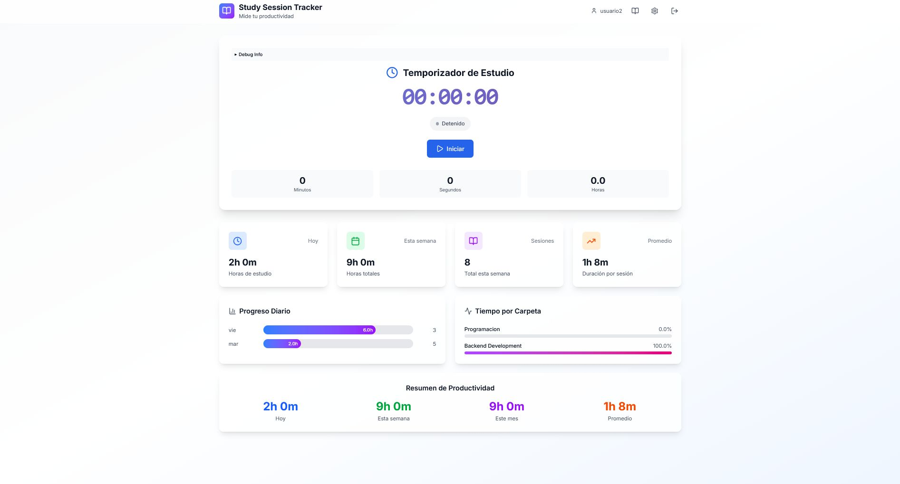

# Sistema de Gestion de Sesiones de Estudio

Proyecto fullstack para registrar, organizar y analizar sesiones de estudio, desarrollado con backend en Java 17 y Spring Boot, frontend en React con TypeScript y persistencia en PostgreSQL. El sistema permite a los usuarios gestionar sus sesiones, clasificarlas mediante carpetas y etiquetas, consultar estadisticas de productividad y trabajar con autenticacion segura mediante JWT.

## Descripcion general

El objetivo del proyecto fue construir una aplicacion web para ayudar a estudiantes a organizar su tiempo de estudio y analizar sus habitos de productividad. La plataforma permite registrar sesiones, asociarlas a carpetas o categorias, utilizar informacion historica para obtener metricas y visualizar analisis semanales, mensuales y por areas de estudio.

El sistema fue pensado como una solucion fullstack: el backend expone una API REST segura y organizada por capas, mientras que el frontend consume esos endpoints para ofrecer una interfaz dinamica de gestion y visualizacion de datos.

## Funcionalidades principales

- Registro e inicio de sesion de usuarios.
- Autenticacion segura mediante JWT.
- Gestion de sesiones de estudio con operaciones CRUD.
- Organizacion de sesiones mediante carpetas y etiquetas.
- Analisis semanal y mensual de productividad.
- Estadisticas por carpeta o area de estudio.
- Analisis de horas de mayor productividad.
- Frontend web con React, TypeScript y Vite.
- Consumo de API REST desde la interfaz.
- Persistencia de datos en PostgreSQL mediante JPA/Hibernate.

## Backend

El backend fue desarrollado con Spring Boot 3 y Java 17, exponiendo una API REST para gestionar usuarios, carpetas, sesiones y analiticas. La arquitectura se organizo por capas, separando controladores, servicios, repositorios, entidades, DTOs, mappers, configuraciones y seguridad.

La estructura principal del backend incluye:

- **Controllers:** definicion de endpoints REST.
- **Services:** logica de negocio de usuarios, sesiones, carpetas y analiticas.
- **Repositories:** acceso a datos mediante Spring Data JPA.
- **Models:** entidades persistidas en PostgreSQL.
- **DTOs:** objetos de transferencia para entrada y salida de datos.
- **Mappers:** conversion entre entidades y DTOs.
- **Config:** configuraciones generales de Spring.
- **Security:** autenticacion, autorizacion y manejo de JWT.

## Endpoints principales

La API incluye endpoints para los modulos centrales del sistema:

### Autenticacion

- `POST /auth/register`
- `POST /auth/login`

### Carpetas

- `GET /folders`
- `POST /folders`
- `GET /folders/{id}`
- `PUT /folders/{id}`
- `DELETE /folders/{id}`

### Sesiones

- `GET /sessions`
- `POST /sessions`
- `GET /sessions/{id}`
- `PUT /sessions/{id}`
- `DELETE /sessions/{id}`

### Analiticas

- `GET /analytics/weekly`
- `GET /analytics/monthly`
- `GET /analytics/by-folder`
- `GET /analytics/productivity-hours`

## Seguridad

El sistema incorpora autenticacion basada en JWT para proteger los endpoints privados y asociar la informacion a cada usuario. Tambien se utilizo BCrypt para el cifrado de contrasenas y configuracion de CORS para permitir la comunicacion con clientes frontend durante el desarrollo.

La seguridad fue una parte importante del proyecto, ya que las sesiones, carpetas y analiticas deben estar vinculadas al usuario autenticado y no quedar expuestas a otros usuarios.

## Base de datos

La persistencia se implemento con PostgreSQL, utilizando Spring Data JPA e Hibernate para mapear las entidades del dominio a tablas relacionales. El proyecto contempla entidades como usuarios, carpetas, sesiones, etiquetas y relaciones entre sesiones y etiquetas.

Tambien se considero el uso de Supabase como proveedor PostgreSQL, manteniendo una configuracion adaptable mediante variables de entorno para credenciales de base de datos y secreto JWT.

## Frontend

El frontend fue desarrollado con React, TypeScript y Vite. Su objetivo fue brindar una interfaz web dinamica para que el usuario pueda interactuar con la API, gestionar sesiones de estudio y visualizar informacion de productividad.

Desde el frontend se trabajaron conceptos como:

- Componentizacion de la interfaz.
- Consumo de endpoints REST.
- Manejo de formularios.
- Visualizacion de informacion de sesiones y estadisticas.
- Separacion entre vistas, componentes y logica de comunicacion con el backend.
- Experiencia de usuario orientada a seguimiento y organizacion del estudio.

## Arquitectura y organizacion

El proyecto se estructuro separando claramente frontend y backend. Esta division permitio trabajar con responsabilidades independientes:

- El **backend** concentra la logica de negocio, seguridad, persistencia y exposicion de endpoints.
- El **frontend** se encarga de la experiencia de usuario, interaccion visual y consumo de la API.
- La **base de datos** almacena usuarios, sesiones, carpetas, etiquetas y datos necesarios para las analiticas.

Esta organizacion replica una arquitectura cliente-servidor comun en aplicaciones web modernas y facilita la evolucion independiente de cada parte del sistema.

## Tecnologias utilizadas

- Java 17
- Spring Boot 3
- Spring Security
- JWT
- BCrypt
- Spring Data JPA
- Hibernate
- PostgreSQL
- Supabase
- Maven
- React
- TypeScript
- Vite
- APIs REST
- Git/GitHub

## Valor del proyecto

Este proyecto me permitio integrar conocimientos de backend, frontend, base de datos, seguridad y analisis de datos en una aplicacion fullstack completa. Fue una experiencia importante para practicar el diseno de APIs REST con Spring Boot, autenticacion con JWT, persistencia relacional con PostgreSQL y consumo de servicios desde una interfaz moderna en React.

Tambien reforzo habilidades de organizacion de codigo, separacion de responsabilidades, modelado de entidades, documentacion de endpoints y construccion de funcionalidades orientadas a usuarios reales. El componente de analiticas agrego una capa adicional de valor, permitiendo transformar registros de sesiones en informacion util para mejorar la productividad del usuario.

[Repositorio Backend](https://github.com/FrancoCamen/SST_Backend.git)
[Repositorio Frontend](https://github.com/FrancoCamen/SST_Frontend.git)
