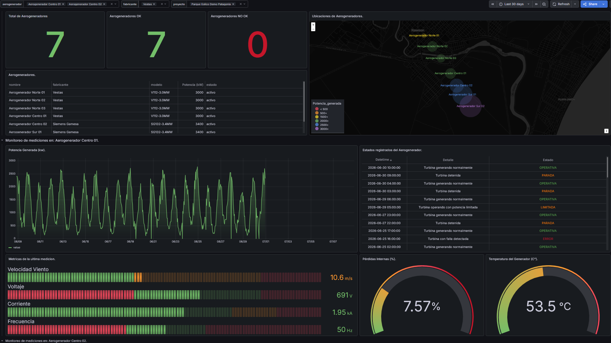

# Sistema de Monitoreo Eolico con Grafana

Proyecto de monitoreo y analisis de datos para un parque eolico, desarrollado con PostgreSQL, Python y Grafana. La solucion permite almacenar datos de infraestructura y mediciones, generar series temporales sinteticas y visualizar indicadores operativos mediante dashboards interactivos.

## Descripcion general

El proyecto fue creado para representar un escenario de monitoreo de sistemas de energias renovables. Se disenaron las estructuras de datos de un parque eolico, se desarrollaron scripts para generar y cargar mediciones historicas y se construyeron dos dashboards en Grafana: uno orientado al estudio del recurso eolico y otro al seguimiento de la curva de potencia de los aerogeneradores.

La solucion integra el flujo completo desde la generacion de datos hasta su visualizacion:

```text
Scripts Python / cargas SQL
            |
            v
       PostgreSQL
            |
            v
          Grafana
```

Grafana fue ejecutado en Docker y configurado para consultar PostgreSQL como fuente de datos. Los dashboards permiten filtrar la informacion por proyecto, torre, sensor, fabricante y aerogenerador.



## Objetivos del proyecto

- Modelar la informacion tecnica y operativa de un parque eolico.
- Generar datos historicos para periodos e intervalos configurables.
- Analizar condiciones meteorologicas y comportamiento del viento.
- Comparar la potencia real de las turbinas con la potencia teorica esperada.
- Detectar desvios, perdidas, estados anormales y mediciones faltantes.
- Construir tableros interactivos para facilitar el seguimiento de indicadores.
- Practicar la integracion entre bases de datos, automatizacion y observabilidad.

## Modelo de datos

La base de datos PostgreSQL se organizo en dos dominios relacionados.

### Monitoreo del recurso eolico

- `proyectos_eolicos`: informacion general de cada parque o proyecto.
- `torres_eolicas`: ubicacion, altura y estado de las torres meteorologicas.
- `estados_sensor`: catalogo de estados de las mediciones.
- `sensores_eolicos`: anemometros, veletas y sensores meteorologicos.
- `mediciones_eolicas`: velocidad y direccion del viento, rafagas, turbulencia, temperatura, humedad, presion y densidad del aire.

La carga inicial incluye un parque de demostracion, dos torres meteorologicas y sensores instalados a distintas alturas.

### Monitoreo de aerogeneradores

- `aerogeneradores`: informacion tecnica, fabricante, modelo y ubicacion de cada turbina.
- `estados_turbina`: estados como operativa, parada, error, mantenimiento o limitada.
- `curva_potencia_fabricante`: potencia teorica esperada para cada velocidad de viento.
- `mediciones_turbina`: variables electricas, mecanicas, termicas y de rendimiento.

El escenario incluye siete aerogeneradores correspondientes a dos modelos de fabricantes diferentes, cada uno con su propia curva teorica de potencia.

## Generacion automatizada de datos

Se desarrollaron scripts en Python para producir e insertar datos historicos simulados. Los scripts permiten definir:

- fecha y hora de inicio;
- fecha y hora de finalizacion;
- intervalo entre mediciones;
- semilla aleatoria;
- tamano de los lotes de insercion.

Para el recurso eolico se simularon ciclos diarios, variaciones por altura y torre, rafagas, turbulencia, condiciones meteorologicas y casos ocasionales sin datos o con valores invalidos.

Para los aerogeneradores, los scripts consultan las turbinas y curvas teoricas almacenadas en PostgreSQL. A partir de esa informacion:

- interpolan la potencia esperada segun la velocidad del viento;
- calculan potencia real, desvio y perdidas internas;
- generan energia acumulada;
- simulan voltaje, corriente y frecuencia;
- generan RPM, angulo de pala y temperaturas;
- representan estados normales, limitados, detenidos o con error.

Las inserciones utilizan `INSERT ... ON CONFLICT DO UPDATE`, permitiendo repetir una carga para el mismo activo y periodo sin duplicar registros.

## Dashboard de Monitoreo del Recurso Eolico

Este dashboard fue disenado para estudiar la disponibilidad y calidad del recurso eolico a partir de la informacion registrada por las torres y sus sensores.

Incluye visualizaciones e indicadores como:

- velocidad del viento en tiempo real;
- promedios diarios de velocidad;
- direccion predominante y distribucion historica;
- evolucion de rafagas maximas;
- niveles de turbulencia;
- temperatura y humedad;
- ultima medicion registrada por torre;
- ubicacion y estado de las torres;
- estado de proyectos y sensores;
- registro de fallos, datos invalidos o mediciones faltantes.

El tablero permite filtrar los resultados por proyecto, torre y sensor.

## Dashboard de Monitoreo de Curva de Potencia

Este dashboard permite analizar el comportamiento de los aerogeneradores y comparar su produccion real con la curva de potencia definida por el fabricante.

Incluye:

- curva de potencia real por aerogenerador;
- comparacion entre potencia generada y potencia esperada;
- potencia instantanea;
- energia producida por dia;
- desvio de potencia;
- estimacion de perdidas internas;
- temperaturas de gondola y generador;
- RPM del rotor;
- angulo de las palas;
- variables electricas en tiempo real;
- estados operativos de las turbinas;
- alertas por bajo rendimiento;
- ubicacion y detalle tecnico de los aerogeneradores.

Las variables del dashboard permiten explorar la informacion por proyecto, fabricante y aerogenerador.

## Consultas y calculos

Las consultas SQL se utilizaron tanto para alimentar los paneles como para transformar las mediciones en indicadores utiles.

Por ejemplo, la energia generada durante un periodo se obtiene a partir de la diferencia entre lecturas del contador acumulado:

```sql
SELECT
  aerogenerador_id,
  date_trunc('day', timestamp) AS dia,
  MAX(energia_generada_kwh) - MIN(energia_generada_kwh) AS energia_dia_kwh
FROM mediciones_turbina
GROUP BY aerogenerador_id, date_trunc('day', timestamp)
ORDER BY dia, aerogenerador_id;
```

Tambien se aplicaron funciones de ventana como `LAG` para calcular la energia producida entre dos mediciones consecutivas.

## Tecnologias utilizadas

- Grafana
- PostgreSQL
- SQL
- Python 3
- Psycopg / Psycopg2
- Docker
- Series temporales
- Modelado de datos
- Generacion automatizada de datos
- Dashboards e indicadores operativos

## Decisiones tecnicas

- Separacion del sistema en los dominios de recurso eolico y curva de potencia.
- PostgreSQL como repositorio central de activos, configuraciones y mediciones historicas.
- Scripts parametrizables para generar datos en fechas e intervalos especificos.
- Inserciones idempotentes para evitar duplicados durante nuevas ejecuciones.
- Curvas teoricas almacenadas en la base para admitir distintos fabricantes y modelos.
- Uso de filtros y variables de Grafana para explorar los datos por diferentes niveles.
- Exportacion de los dashboards en formato JSON para facilitar su reutilizacion.
- Ejecucion de Grafana en Docker para simplificar la configuracion del entorno.

## Valor del proyecto

Este proyecto me permitio integrar conocimientos de modelado de datos, SQL, automatizacion con Python y construccion de dashboards en Grafana dentro de un caso aplicado al sector de energias renovables.

Tambien reforzo mi capacidad para transformar mediciones tecnicas en indicadores utiles, trabajar con series temporales, comparar valores reales y esperados, analizar desvios y construir herramientas visuales de monitoreo para apoyar decisiones operativas.

Los datos utilizados son sinteticos y fueron generados con fines de desarrollo, prueba y demostracion. El proyecto no reemplaza informacion proveniente de sistemas SCADA ni especificaciones oficiales de fabricantes.

[Repositorio](https://github.com/FrancoCamen/Sistema_Monitoreo_Eolico.git)
